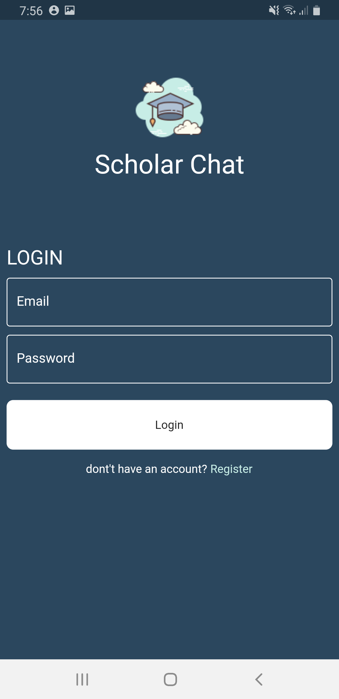
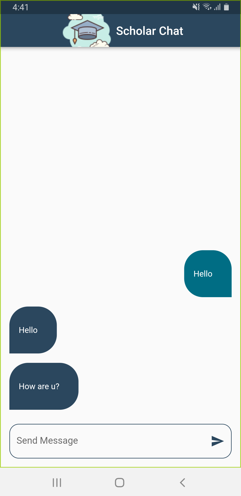

# chatapp

A new Flutter project.

## Getting Started

Resources:⬇️⬇️⬇️⬇️⬇️

-- https://pub.dev/packages/firebase_aut

-- https://pub.dev/packages/cloud_firestore

-- https://pub.dev/packages/firebase_core

-- https://pub.dev/packages/modal_progress_hud_nsn

-- I'm use firebase for the project Chat

-- And i use animation 

-- And i use the refactor the code

    

    

