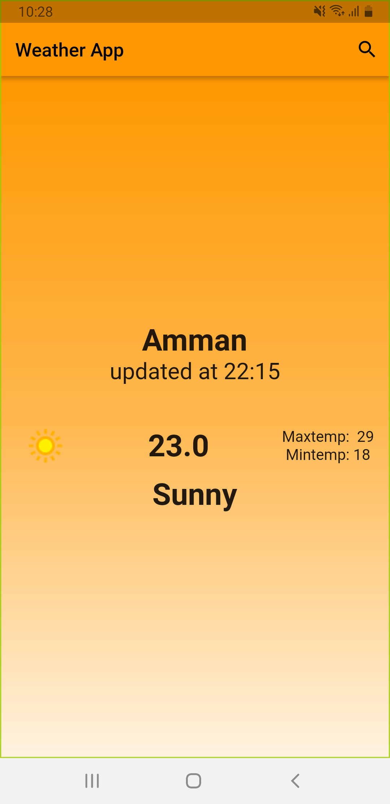
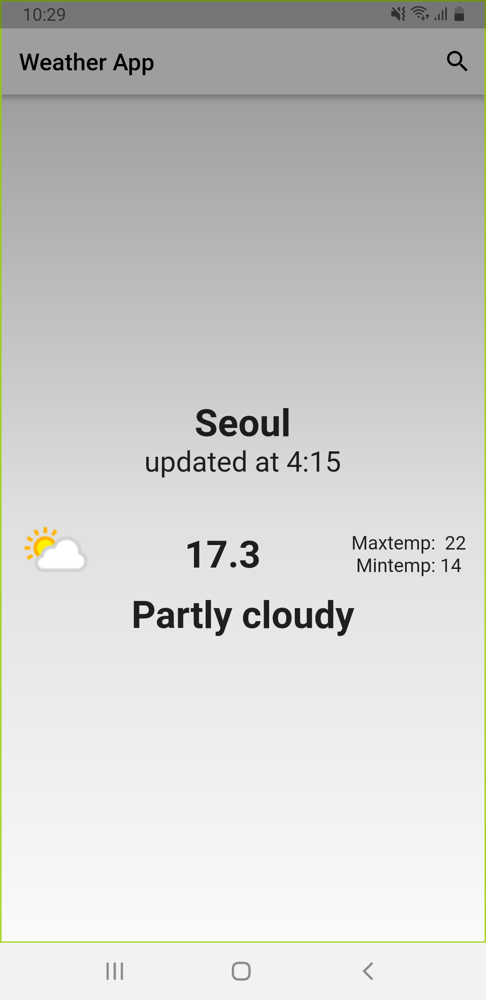

# weatherapp

A new Flutter project.

## Getting Started

Resources:⬇️⬇️⬇️⬇️⬇️

-- https://www.weatherapi.com/

-- https://pub.dev/packages/dio

-- https://pub.dev/packages/flutter_bloc

    

    

    

<!DOCTYPE html>
<html lang="en">
<head>
    <meta charset="UTF-8">
    <meta name="viewport" content="width=device-width, initial-scale=1.0">
    <title>Image Grid</title>
    
</head>
<body>
    

        

            
        

        

            
        

        <!-- Add more grid items as needed -->
    

</body>
</html>